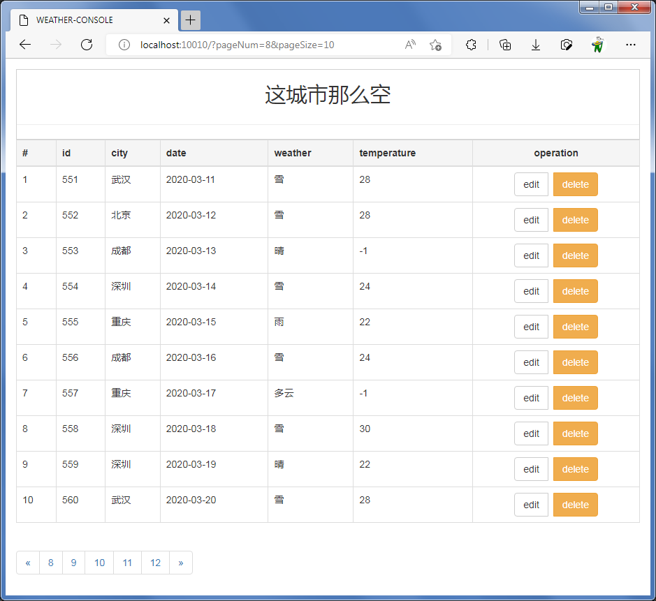

## 简介
基于spring web、jdbc、thymeleaf、tk.mybatis、pagehelper，从数据库查询数据，显示在web页面，支持分页。

## 运行
1. 执行resources/weather.sql建表，然后运行test下面的测试用例生成测试数据。
2. 启动Application，访问http://localhost:10010/

## 截图

## 参考
前端页面参考了[chenerzhu/quartz-console](https://github.com/chenerzhu/quartz-console)